# Dikshant Neupane

  <picture>
    <source media="(prefers-color-scheme: dark)" srcset="./assets/dark.svg" />
    <source media="(prefers-color-scheme: light)" srcset="./assets/light.svg" />
    
  </picture>

Building software, exploring AI, and shipping useful products with a focus on clarity, utility, and measurable impact.

<a href="mailto:dikshantneupane690@gmail.com">Email</a> • <a href="https://www.linkedin.com/in/dikshant-neupane-a64b09326/">LinkedIn</a> • <a href="https://github.com/Dikshant-Neupane">GitHub</a>

---

## Current Project

Refining my GitHub profile art generator, which turns a photo into animated ASCII and Braille SVG banners.

## About

I am a BSc CSIT student at Tribhuvan University with interests in software engineering, artificial intelligence, machine learning, and data analytics.

## Currently Building

- Digital Brain
- Civic Complaint Platform
- AI-powered productivity tools
- Data analytics projects
- Full-stack web applications

## Technologies

  

## Featured Work

### Digital Brain

An AI-powered personal knowledge system focused on memory, organization, and productivity.

**Focus:** AI, Knowledge Management, Productivity

### Civic Complaint Platform

A platform designed to improve communication between citizens and local governments through structured issue reporting and tracking.

**Focus:** Civic Tech, Public Services, Transparency

### Data Analytics Projects

Projects involving data processing, visualization, reporting, and analytical insights.

**Focus:** Analytics, Visualization, Decision Support

### Full-Stack Applications

Web applications built with an emphasis on maintainability, usability, and scalable architecture.

**Focus:** Backend Systems, APIs, User Experience

## Leadership & Activities

- Marketing Head, Hult Prize Nepal
- Hackathon Participant
- Open Source Contributor
- Independent Project Builder

## GitHub Statistics

  
  

  

## Contribution Activity

  

## Philosophy

> Build useful things.
>
> Learn continuously.
>
> Share knowledge.
>
> Improve every day.

## Connect

- Email: [dikshantneupane690@gmail.com](mailto:dikshantneupane690@gmail.com)
- LinkedIn: <https://www.linkedin.com/in/dikshant-neupane-a64b09326/>
- GitHub: <https://github.com/Dikshant-Neupane>